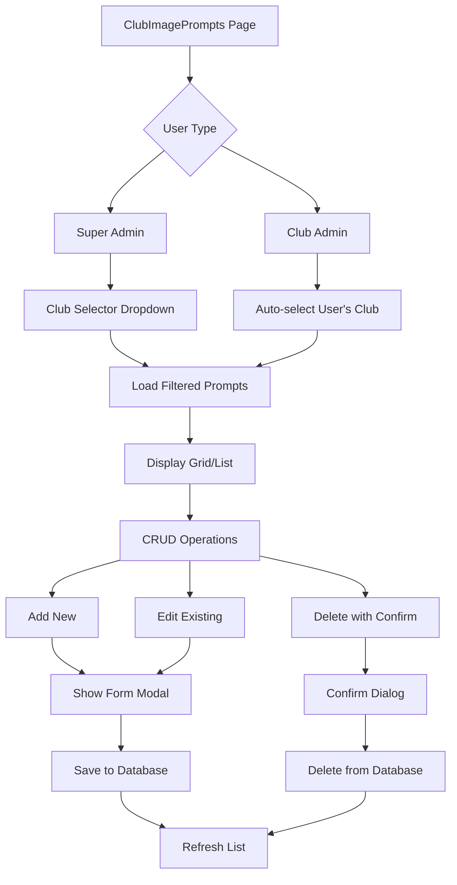

# Club Image Prompts CRUD Implementation Plan

## Overview
Create a maintenance program (CRUD) for the `club_image_prompts` table with club selector, grid/list view showing image_type, image_spec, image_output, and full CRUD operations.

## Database Table Structure
The table `club_image_prompts` already exists with the following columns:
- `prompt_id` (UUID, PRIMARY KEY, auto-generated)
- `club_id` (foreign key to clubs.club_id)
- `image_type` (TEXT, 30 chars, text entry)
- `image_spec` (text area entry)
- `image_prompt` (text area entry)
- `image_layout` (TEXT, text area entry small section)
- `image_output` (TEXT, file format jpg/png, 30 chars text entry)
- `created_at` (auto-created with now())

## Implementation Steps

### 1. TypeScript Interface
Add to `src/types/database.ts`:
```typescript
export interface ClubImagePrompt {
  prompt_id: string
  club_id: string
  image_type?: string | null
  image_spec?: string | null
  image_prompt?: string | null
  image_layout?: string | null
  image_output?: string | null
  created_at?: string
}
```

### 2. Route Configuration
Add to `src/App.tsx`:
- Import: `import { ClubImagePrompts } from './pages/ClubImagePrompts'`
- Add route: `<Route path="club-prompts" element={<ClubImagePrompts />} />`
- Place under the Clubs section in routing

### 3. Navigation Update
Update `src/components/Layout.tsx` NAV array:
- Add to Clubs section after "Category Images":
```typescript
{ path:'/club-prompts', label:'Club Prompts', icon:'🎨' }
```

### 4. Component Structure
Create `src/pages/ClubImagePrompts.tsx` with:
- Club selector (for super admins) to filter by club
- Grid/List view showing: image_type, image_spec, image_output
- CRUD buttons: Add, Edit, Delete
- Form modal for creating/editing entries

### 5. Data Fetching Logic
Similar to other CRUD pages (Categories.tsx pattern):
- Use `supabase.from('club_image_prompts').select('*')`
- Filter by club_id for non-super admins
- Club selector for super admins to filter results
- Order by created_at descending

### 6. Form Design
Modal form with fields:
- **Club** (dropdown for super admins, readonly for club admins)
- **Image Type** (text input, max 30 chars)
- **Image Spec** (textarea, medium size)
- **Image Prompt** (textarea, large size for AI prompts)
- **Image Layout** (textarea, small section)
- **Image Output** (text input, max 30 chars, placeholder: "jpg, png")

### 7. CRUD Operations
- **Create**: Insert new record with current club_id
- **Read**: Display in table with pagination
- **Update**: Edit existing prompts
- **Delete**: Confirm dialog before deletion

### 8. UI/UX Considerations
- Consistent styling with existing admin pages
- Responsive grid/list view
- Loading states and error handling
- Success/error messages for operations
- Club filtering preserved in URL state

### 9. Testing Checklist
- [ ] Club selector works for super admins
- [ ] Club admins see only their club's prompts
- [ ] CRUD operations function correctly
- [ ] Form validation works
- [ ] Navigation item appears correctly
- [ ] Data displays properly in grid/list

## Mermaid Diagram: Component Flow



## File Dependencies
1. `src/types/database.ts` - TypeScript interface
2. `src/App.tsx` - Route configuration
3. `src/components/Layout.tsx` - Navigation
4. `src/pages/ClubImagePrompts.tsx` - Main component
5. `src/lib/supabase.ts` - Database client
6. `src/lib/store.ts` - Admin store for user context

## Success Criteria
- Users can navigate to "Club Prompts" from sidebar
- Club filtering works as in other admin pages
- All CRUD operations function without errors
- Data persists correctly in database
- UI is consistent with existing admin interface

## Notes
- The `image_output` field stores file format text (jpg/png), not actual file paths
- Text areas should have appropriate sizes: image_spec (medium), image_prompt (large), image_layout (small)
- Club selector should match the pattern used in Categories.tsx and other pages
- Add the navigation item under "Clubs" section after "Category Images"